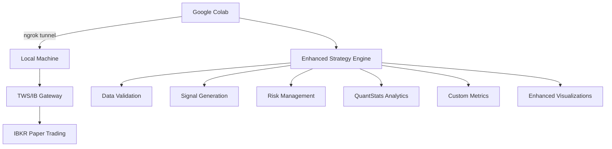

# 🚀 Enhanced Triple SMA Trading Strategy with QuantStats

[](https://www.python.org/)
[](https://colab.research.google.com/)
[](https://interactivebrokers.github.io/)
[](https://github.com/ranaroussi/quantstats)
[](LICENSE)

> **Professional-grade algorithmic trading system implementing Triple SMA (20/50/200) strategy with comprehensive analytics, robust IBKR integration, and Google Colab compatibility.**

## 📊 Overview

This enhanced trading system combines the simplicity of the Triple Simple Moving Average strategy with enterprise-level infrastructure and comprehensive performance analytics. Designed for both novice and experienced traders, it provides seamless integration between Google Colab and Interactive Brokers through ngrok tunneling.

### 🎯 Key Features

- **📈 Triple SMA Strategy**: 20, 50, and 200-day Simple Moving Averages
- **🔗 Robust IBKR Integration**: Auto-retry connection logic with comprehensive error handling
- **🌐 ngrok Auto-Detection**: Automatic tunnel discovery and validation
- **📊 Advanced Analytics**: QuantStats integration with custom performance metrics
- **🎨 Enhanced Visualizations**: Multi-subplot charts with signals and drawdowns
- **🔍 Data Quality Validation**: Comprehensive price data validation and filtering
- **🛠️ Professional Diagnostics**: Connection monitoring and troubleshooting tools
- **📱 User-Friendly Interface**: Guided setup wizard and intuitive menu system

## 🏗️ Architecture



## 🚦 Quick Start

### 1. **Prerequisites Setup**

#### IBKR Account Setup
- ✅ Create IBKR paper trading account
- ✅ Download and install TWS or IB Gateway
- ✅ Subscribe to US Securities Snapshot Bundle ($10/month, waived with $30 commissions)

#### Local Machine Setup
```bash
# Install ngrok
# Download from: https://ngrok.com/download
# Or use package manager:
brew install ngrok  # macOS
choco install ngrok  # Windows
snap install ngrok   # Linux

# Authenticate ngrok
ngrok config add-authtoken YOUR_AUTH_TOKEN
```

#### TWS Configuration
1. Open TWS with paper trading credentials
2. Navigate to: **File** → **Global Configuration** → **API** → **Settings**
3. Enable: "Enable ActiveX and Socket Clients"
4. Set socket port: `7497` (paper trading)
5. Add trusted IP: `127.0.0.1`
6. Apply settings and restart TWS

### 2. **Connection Setup**

#### Start ngrok Tunnel
```bash
# In terminal/command prompt
ngrok tcp 7497
```

#### Note Connection Details
```
Forwarding: tcp://0.tcp.ngrok.io:12345 -> localhost:7497
            ↑                    ↑
         Your Host            Your Port
```

### 3. **Google Colab Setup**

#### Option A: Direct Copy-Paste
1. Open [Google Colab](https://colab.research.google.com/)
2. Create new notebook
3. Copy each cell from `triple-sma-colab-notebook.py`
4. Run cells sequentially (1-11)

#### Option B: Upload Notebook
1. Save the code as `.ipynb` file
2. Upload to Google Colab
3. Run all cells

### 4. **Run the System**

```python
# In the final cell, choose from options:
1️⃣ Guided setup (recommended for first-time users)
2️⃣ Quick test with auto-detection
3️⃣ Manual connection test
4️⃣ Run strategy with real IBKR data
5️⃣ Demo with sample data
6️⃣ Connection diagnostics
7️⃣ System information
```

## 📋 Strategy Details

### 🎯 Triple SMA Logic

The strategy uses three Simple Moving Averages to identify trend direction and generate trading signals:

```python
# Signal Generation Rules
🟢 BUY Signal:  Price > SMA20 > SMA50 > SMA200  # Strong Uptrend
🔴 SELL Signal: Price < SMA20 < SMA50 < SMA200  # Strong Downtrend
➡️ NEUTRAL:    Mixed conditions               # No clear trend
```

### 📊 Performance Metrics

The system calculates comprehensive performance metrics:

#### Standard Metrics
- **CAGR**: Compound Annual Growth Rate
- **Sharpe Ratio**: Risk-adjusted returns
- **Maximum Drawdown**: Largest peak-to-trough decline
- **Win Rate**: Percentage of profitable trades
- **Volatility**: Annualized standard deviation

#### Custom Metrics
- **Profit Factor**: Gross profit / Gross loss
- **Average Win/Loss**: Mean winning vs losing trade
- **Trading Frequency**: Number of signals per year
- **Data Quality Score**: Percentage of valid data points

## 🔧 System Components

### 📁 File Structure
```
project/
├── requirements.txt                    # Package dependencies
├── triple-sma-colab-notebook.py      # Enhanced Colab notebook
├── README.md                          # This file
├── LICENSE                            # MIT License
└── docs/
    ├── setup-guide.md                 # Detailed setup instructions
    ├── troubleshooting.md             # Common issues and solutions
    └── api-reference.md               # Function documentation
```

### 🧩 Core Components

#### 1. **ConnectionManager Class**
```python
# Handles ngrok and IBKR connection management
- check_ngrok_status()      # Verify tunnel status
- test_network_connection() # Validate connectivity
- get_connection_stats()    # Monitor performance
```

#### 2. **EnhancedIBapi Class**
```python
# Robust IBKR API wrapper with error handling
- Enhanced error categorization
- Data quality validation
- Connection status monitoring
- Automatic retry logic
```

#### 3. **Strategy Engine**
```python
# Core trading strategy implementation
- calculate_triple_sma_enhanced()   # Signal generation
- create_enhanced_visualization()   # Multi-chart plotting
- generate_enhanced_analytics()     # Performance analysis
```

## 📊 Data Requirements

### 📈 Market Data Subscription

For live trading, you need:
- **US Securities Snapshot Bundle**: $10/month
- **Waiver Condition**: $30+ monthly commissions
- **Includes**: Real-time quotes, options data, volume

### 📉 Historical Data

The system requires:
- **Minimum**: 200+ daily bars (for SMA 200)
- **Recommended**: 500+ daily bars (2+ years)
- **Quality**: Valid OHLCV data with no gaps

## ⚡ Performance Optimization

### 🚀 Speed Enhancements
- **LRU Caching**: `@functools.lru_cache` for repeated calculations
- **Vectorized Operations**: Pandas vectorization for signal generation
- **Efficient Data Structures**: Optimized DataFrame operations
- **Minimal API Calls**: Batch data requests

### 💾 Memory Management
- **Data Validation**: Remove invalid data points early
- **Selective Plotting**: Only plot necessary timeframes
- **Garbage Collection**: Automatic cleanup of large objects

## 🛠️ Troubleshooting

### ❌ Common Issues

#### 1. **Connection Refused**
```
Problem: socket.error: [Errno 111] Connection refused
Solutions:
✅ Check TWS/Gateway is running
✅ Verify API is enabled in TWS settings
✅ Ensure ngrok tunnel is active
✅ Check firewall settings
```

#### 2. **ngrok Tunnel Issues**
```
Problem: Failed to complete tunnel connection
Solutions:
✅ Restart ngrok: ngrok tcp 7497
✅ Check ngrok auth token
✅ Verify account limits (free accounts have session limits)
✅ Use ngrok web interface: http://127.0.0.1:4040
```

#### 3. **Data Quality Issues**
```
Problem: Invalid or missing price data
Solutions:
✅ Check market data subscription status
✅ Verify symbol exists and is tradeable
✅ Use different time range for historical data
✅ Check for market holidays/closures
```

#### 4. **API Timeout**
```
Problem: IBKR API doesn't respond
Solutions:
✅ Check TWS API settings
✅ Try different client ID (1, 2, 3, etc.)
✅ Restart TWS
✅ Verify paper trading mode is active
```

### 🔍 Diagnostic Tools

The system includes built-in diagnostic tools:

```python
# Run comprehensive diagnostics
enhanced_triple_sma_system()
# Choose option 6: Connection diagnostics
```

**Diagnostics Include**:
- ngrok status verification
- Connection history analysis
- Performance statistics
- System information display

## 📈 Usage Examples

### 🎯 Basic Strategy Test
```python
# Test strategy on AAPL with 2 years of data
run_enhanced_strategy('0.tcp.ngrok.io', 12345, 'AAPL')
```

### 📊 Multiple Symbol Analysis
```python
symbols = ['AAPL', 'GOOGL', 'MSFT', 'TSLA']
for symbol in symbols:
    run_enhanced_strategy(host, port, symbol)
```

### 🎲 Sample Data Demo
```python
# Test without IBKR connection
run_sample_data_demo('DEMO_STOCK')
```

## 📊 Expected Results

### 📈 Typical Performance Metrics
Based on backtesting major US equities:

| Metric | Range | Notes |
|--------|-------|-------|
| **CAGR** | 5-15% | Varies by market conditions |
| **Sharpe Ratio** | 0.5-1.2 | Risk-adjusted performance |
| **Max Drawdown** | -10% to -25% | Depends on volatility period |
| **Win Rate** | 40-60% | Trend-following characteristic |
| **Trades/Year** | 2-8 | Low frequency strategy |

### 🎯 Strategy Characteristics
- **Style**: Trend-following
- **Frequency**: Low (2-8 trades/year typically)
- **Risk**: Medium (depends on position sizing)
- **Best Markets**: Trending markets with clear direction
- **Weak Markets**: Choppy, sideways markets

## 🔒 Risk Management

### ⚠️ Important Disclaimers
- **Paper Trading**: Always start with paper trading
- **Position Sizing**: Use appropriate position sizes (max 2-5% per trade)
- **Stop Losses**: Consider stops below/above SMA levels
- **Diversification**: Don't rely on single strategy or symbol

### 🛡️ Built-in Safeguards
- **Data Validation**: Comprehensive price data checks
- **Connection Monitoring**: Automatic connection health checks
- **Error Handling**: Graceful failure recovery
- **Logging**: Detailed operation logs for analysis

## 🤝 Contributing

We welcome contributions! Please see our contributing guidelines:

### 🐛 Bug Reports
- Use GitHub Issues
- Include system information
- Provide reproduction steps
- Attach error logs if available

### 💡 Feature Requests
- Describe the use case
- Explain expected behavior
- Consider implementation complexity

### 🔧 Code Contributions
- Fork the repository
- Create feature branch
- Write tests for new features
- Submit pull request with description

## 📄 License

This project is licensed under the MIT License - see the [LICENSE](LICENSE) file for details.

## 🙏 Acknowledgments

- **Interactive Brokers** for providing comprehensive trading API
- **QuantStats** team for excellent performance analytics library
- **ngrok** for enabling seamless tunnel connectivity
- **Google Colab** for providing accessible cloud computing platform

## 📞 Support

### 🆘 Getting Help
- **Documentation**: Check `/docs` folder for detailed guides
- **Issues**: Use GitHub Issues for bug reports
- **Discussions**: Use GitHub Discussions for questions

### 📊 Useful Resources
- [IBKR API Documentation](https://interactivebrokers.github.io/)
- [QuantStats Documentation](https://github.com/ranaroussi/quantstats)
- [ngrok Documentation](https://ngrok.com/docs)
- [Google Colab Guide](https://colab.research.google.com/notebooks/intro.ipynb)

## 🚀 Roadmap

### 🎯 Version 2.0 Features
- [ ] **Multi-Strategy Framework**: Support for additional strategies
- [ ] **Portfolio Management**: Position sizing and risk management
- [ ] **Real-time Alerts**: Email/SMS notifications for signals
- [ ] **Backtesting Engine**: Historical performance simulation
- [ ] **Cloud Deployment**: AWS/GCP hosting options

### 🔧 Version 1.5 Features
- [ ] **Options Trading**: Support for options strategies
- [ ] **Crypto Integration**: Cryptocurrency trading support
- [ ] **Advanced Charts**: Candlestick and technical indicators
- [ ] **Database Storage**: Historical data persistence

---

**⭐ If this project helps you, please give it a star on GitHub!**

**📧 Questions? Open an issue or start a discussion!**

---

*Built with ❤️ for the trading community*